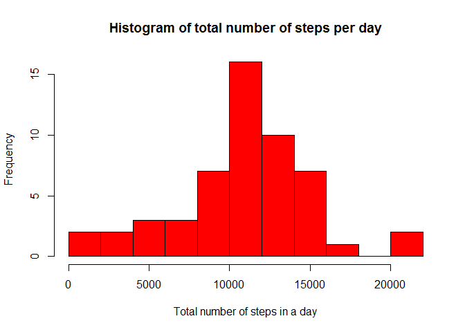
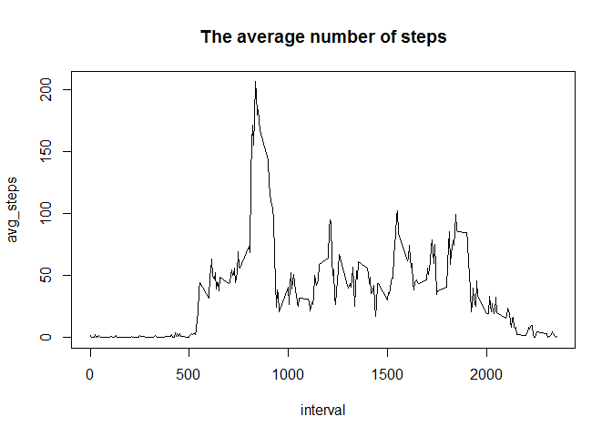
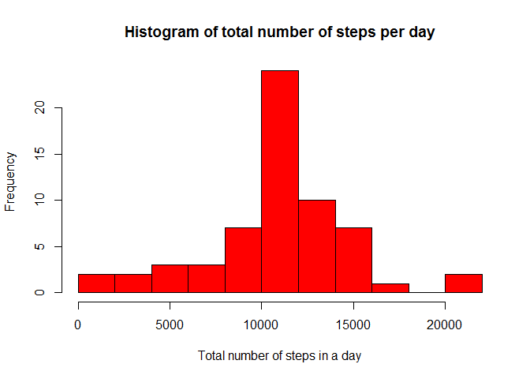
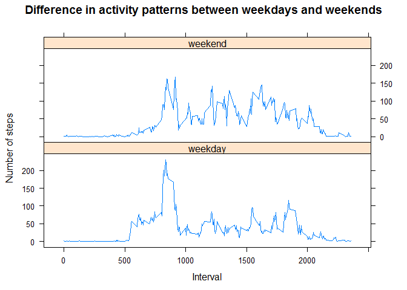

# Reproducible Research: Peer Assessment 1 by Soumya Ghosh


## Loading and preprocessing the data
1. Load the activity data and preprocess and load some R libraries

```r
activity_data <- read.csv("activity.csv", header=TRUE);
activity_data$date <- as.Date(activity_data$date, format = "%Y-%m-%d")
require(dplyr)
require(lattice)
```


## What is mean total number of steps taken per day?

1. Calculate the total number of steps taken per day
   Make a histogram of the total number of steps taken each day

The total number of steps taken per day was calculated by using aggregate function.

```r
steps_day <- activity_data %>% group_by(date) %>% 
    summarise(total_steps = sum(steps))
```
Histogram

```r
hist(steps_day$total_steps, breaks=10, col="red", 
     main="Histogram of total number of steps per day", 
     xlab="Total number of steps in a day")
```

 

2. Calculate and report the mean and median of the total number of steps taken per day


```r
mean(steps_day$total_steps, na.rm = T)
```

```
## [1] 10766.19
```
Median 

```r
median(steps_day$total_steps, na.rm = T)
```

```
## [1] 10765
```

## What is the average daily activity pattern?
1.  Make a time series plot (i.e. type = "l") of the 5-minute interval (x-axis) 
    and the average number of steps taken, averaged across all days (y-axis)


```r
steps_interval <- activity_data %>% group_by(interval) %>% 
    summarise(avg_steps = mean(steps, na.rm=T))
plot(steps_interval, type = "l", main="The average number of steps")
```

 

2.  Which 5-minute interval, on average across all the days in the dataset, 
    contains the maximum number of steps?

```r
steps_interval$interval[which.max(steps_interval$avg_steps)]
```

```
## [1] 835
```


## Imputing missing values
1. Calculate and report the total number of missing values in the dataset (i.e. the total number of rows with NAs)

```r
sum(is.na(activity_data$steps))
```

```
## [1] 2304
```
Total 2304 rows have missing values.

2. Devise a strategy for filling in all of the missing values in the dataset. The strategy does not need to be sophisticated. For example, you could use the mean/median for that day, or the mean for that 5-minute interval, etc.
: I used mean values of 5-minute intervals as fillers for missing values.
3. Create a new dataset that is equal to the original dataset but with the missing data filled in.


```r
activity_filled <-activity_data   # Make a new dataset with the original data
activity_filled <- merge(activity_data, steps_interval, by="interval")
NAs <- is.na(activity_filled$steps)
activity_filled$steps[NAs] <- activity_filled$avg_steps[NAs]
activity_filled$avg_steps <- NULL # Delete this column which was introduced due to merge
sum(complete.cases(activity_data))
```

```
## [1] 15264
```

```r
sum(complete.cases(activity_filled))
```

```
## [1] 17568
```

4. Make a histogram of the total number of steps taken each day and
   Calculate and report the **mean** and **median** total number of
   steps taken per day. Do these values differ from the estimates from
   the first part of the assignment? What is the impact of imputing
   missing data on the estimates of the total daily number of steps?

```r
steps_day <- activity_filled %>% group_by(date) %>% 
    summarise(total_steps = sum(steps))
head(steps_day)
```

```
## Source: local data frame [6 x 2]
## 
##         date total_steps
## 1 2012-10-01    10766.19
## 2 2012-10-02      126.00
## 3 2012-10-03    11352.00
## 4 2012-10-04    12116.00
## 5 2012-10-05    13294.00
## 6 2012-10-06    15420.00
```
Histogram

```r
hist(steps_day$total_steps, breaks=10, col="red", 
     main="Histogram of total number of steps per day", 
     xlab="Total number of steps in a day")
```

 

Calculate and report the mean and median of the total number of steps taken per day


```r
mean(steps_day$total_steps, na.rm = T)
```

```
## [1] 10766.19
```
Median 

```r
median(steps_day$total_steps, na.rm = T)
```

```
## [1] 10766.19
```
By running some commands, we can see that data for steps are missing for 8 whole days.
As missing values are substituted with respective means for 5-minute intervals, this means total steps for that day is same as mean obtained in part 1 of this assignment.
Due to this change in distribution, median changes and here it is same as mean.

## Are there differences in activity patterns between weekdays and weekends?

1. Create a new factor variable in the dataset with two levels --
   "weekday" and "weekend" indicating whether a given date is a
   weekday or weekend day.

```r
#two new columns day and day_type are added to activity_filled, by default day_type is weekday for all weekdays
activity_filled$day <- weekdays(activity_filled$date)
activity_filled$day_type <- c("weekday")

#loop to assign weekends
for (i in 1:nrow(activity_filled)){
    if (activity_filled$day[i] == "Saturday" || activity_filled$day[i] == "Sunday"){
      activity_filled$day_type[i] <- "weekend"
    }
}
```
2.  Make a panel plot containing a time series plot (i.e. type = "l") of the 
    5-minute interval (x-axis) and the average number of steps taken, averaged 
    across all weekday days or weekend days (y-axis). The plot should look something 
    like the following, which was creating using simulated data:

```r
steps_interval <- activity_filled %>% group_by(day_type, interval) %>%
    summarise(steps = mean(steps))
xyplot(steps ~ interval | day_type, steps_interval, type = "l", layout = c(1, 2),
       xlab = "Interval", ylab = "Number of steps", 
       main = "Difference in activity patterns between weekdays and weekends")
```

 
